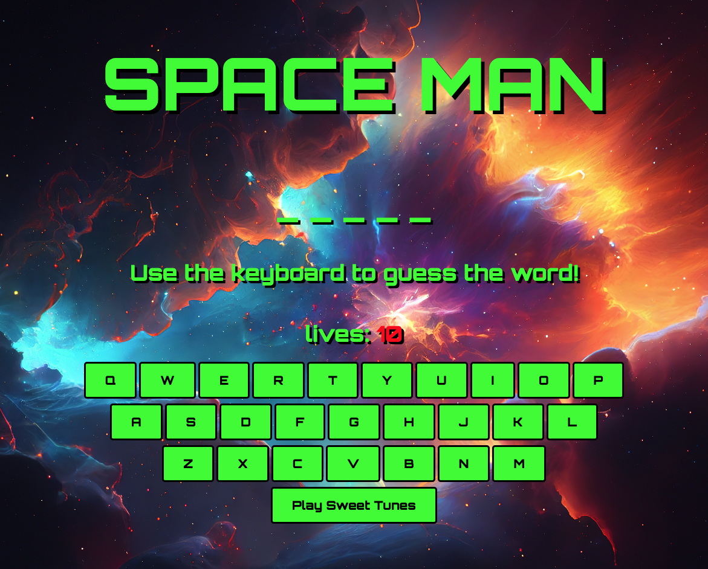

# SPACEMAN 
> Spaceman is a game where you have to guess the secret, space themed, word. If your lives run out before you guess the secret word you lose!

# Screenshot 

 

 # Technologies Used
 1. HTML
 2. CSS
 3. JavaScript

 # Getting Started

click the link to play [Spaceman](https://dawsonchilders.github.io/spaceman-project-1/)

Hint: All secret words are related to outer space!

# Next Steps:

1. add a drop down menu with different word categories

2. add a hint after a TBD amount of incorrect guesses 

3. add more sound effects, and music - potentially change the music to something more intense when guesses reach a lower number

4. add a graphic element that changes as your lives decrease

5. create seperate win and loss screens to help create a narrative - for example, if you lose you are stranded on an alien planet, if you win you blast off on a rocket ship.

